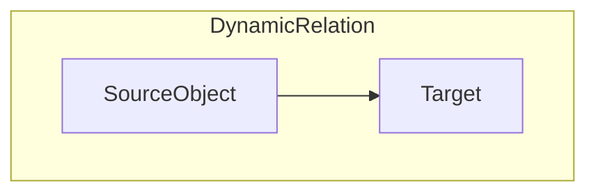
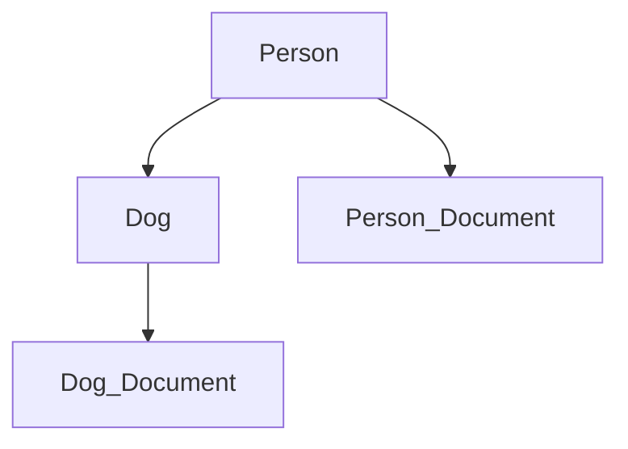
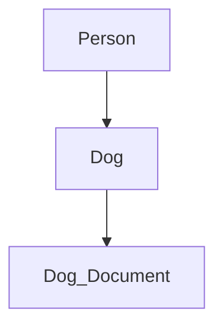

# Dynamic Relations

[](https://github.com/Mom0aut/DynamicRelations/actions/workflows/maven.yml) [](https://github.com/Mom0aut/DynamicRelations/actions/workflows/maven.yml)

In every relational database you must always know which relations are possible to your entities. But sometimes these
relations are unknown or could change anytime. With Dynamic Relations you can add or delete custom relations between
entities during runtime.

# What is a Dynamic Relation?

A dynamic relation can be viewed as a directed graph with a fixed input(SourceObject) and a dynamic output(target).



For example with following entities:

- Person
- Dog
- Document

A person can have a dog and both entites could have documents(person info documents and dog info documents). Now you
could add dynamic relations to all entities which could look like this:



Each connection is a dynamic relation and following relations will be generated:

- Person Relation with SourceObject Person
- Person_Document Relation with SourceObject Person_Document
- Dog Relation with SourceObject Dog
- Dog_Document Relation with SourceObject Dog_Document

Each relation got a dynamic target, that means you could create a relation to any other entity.

In this scenario a person have a dog and both got documents, now you could change the relation during runtime (no
altering of your Entities or Models). For example, you could delete a Person_Document(got lost):



# Maven dependency

```
<dependency>
  <groupId>io.github.mom0aut</groupId>
  <artifactId>dynamic-relations</artifactId>
  <version>1.0.6</version>
</dependency>
```

# How to use

- [Add the @Relation to your Entity](#Relation)
- [Implement RelationIdentity](#RelationIdentity)
- [Import Config Module for Component Scan](#ImportConfig)
- [Use the RelationService](#RelationService)
- [Ignore the @Relation with @IgnoreRelation](#IgnoreRelation)

## <a name="Relation"></a> Add the @Relation

Simply add the @Relation to your existing entity and the necessary dynamic relations entity will be generated. Dynamic
relations are only working with classed which are **annotated with @Entity**!

```java

@Relation
@Entity
@Getter
@Setter
public class Person implements RelationIdentity {

    @Id
    @GeneratedValue(strategy = GenerationType.IDENTITY)
    private Long id;
}
```

## <a name="IgnoreRelation"></a> Ignore the @Relation with @IgnoreRelation

In some cases, you may want to annotate a class with @Relation for documentation or future use,
but **prevent the annotation processor from generating dynamic relation code** for that class.
You can do this by simply adding the @IgnoreRelation annotation.

This is useful for:

- Testing or temporary entities
- Classes that share code structure but should not generate dynamic relations
- Preventing unwanted relation classes in edge cases

```java

@IgnoreRelation
@Relation
@Entity
public class DisabledRelationEntity {

    @Id
    @GeneratedValue(strategy = GenerationType.IDENTITY)
    private Long id;
}
```

## <a name="RelationIdentity"></a> Implement RelationIdentity

Implement the relationIdentity, each dynamic relation need a Long id which you can define.

```java

@Relation
@Entity
@Getter
@Setter
public class Person implements RelationIdentity {

    @Id
    @GeneratedValue(strategy = GenerationType.IDENTITY)
    private Long id;
}

```

## <a name="ImportConfig"></a> Import Configuration for Relation Support

Enable the `DrmConfig` configuration in your Spring Boot application by using the custom `@EnableDynamicRelation`
annotation.   
This activates component scanning for the `at.drm.*` packages and makes the `RelationService` and related beans
available for use.

```java

@EnableDynamicRelation
@SpringBootApplication
public class App {

    public static void main(String[] args) {
        SpringApplication.run(App.class, args);
    }
}
```

## <a name="RelationService"></a> Use the RelationService

### Create Relation

```java

@Autowired
private RelationService relationService;

void createRelation() {
    Person person = new person();
    personDao.save(person);

    Dog dog = new Dog();
    dogDao.save(dog);

    //Dynamic Relation can only be created with persisted Entities!
    RelationLink relationLinkPersonToDog = relationService.createRelation(person, dog);
}

```

**Dynamic relation can only be created with persisted Entities!**

### Delete Relation

```java

@Autowired
private RelationService relationService;

void deleteRelation() {
    relationService.deleteRelation(relationToBeDeleted);
}

```

### Find Relations

```java

@Autowired
private RelationService relationService;

void findRelations() {
    Person person = new person();
    personDao.save(person);

    Dog dog = new Dog();
    dogDao.save(dog);

    Document document = new Document();
    documentDaio.save(document);

    //Dynamic Relation can only be created with persisted Entities!
    RelationLink relationLinkPersonToDog = relationService.createRelation(person, dog);
    RelationLink relationLinkPersonToDocument = relationService.createRelation(person, document);
    RelationLink relationLinkDogToDocument = relationService.createRelation(dog, document);

    //Return 1 Relation person -> dog
    RelationLink foundRelation = relationService.findRelationBySourceObjectAndRelationIdentity(person, dog);
    //Returns 2 Relations person -> dog and person -> document
    List<RelationLink> relationBySourcePerson = relationService.findRelationBySourceObject(person);
    //Returns 2 Relations from person -> document and dog -> document
    Set<RelationLink> relationByTargetDocument = relationService.findRelationByTargetRelationIdentity(document);
}

```

### Get the SourceObject by Relation

```java

@Autowired
private RelationService relationService;

void getSourceObject() {
    RelationLink foundRelation = relationService.findRelationBySourceObjectAndRelationIdentity(person, dog);
    //Can be cast to Person because we know it is from Person.class
    Person sourceObject = (Person) foundRelation.getSourceObject();
}

```

# Limitations

- Java with Spring
- Sql Database (tested with Postgres)

# Contributors

<a href="https://github.com/Mom0aut/DynamicRelations/graphs/contributors">
  
</a>

# Contribution

Every contribution is welcome, please follow
the [Contribution Guidelines](https://github.com/Mom0aut/DynamicRelations/blob/master/Contributing.md)

# Code of Conduct

See our [Code of Conduct](https://github.com/Mom0aut/DynamicRelations/blob/master/CODE_OF_CONDUCT.md)
