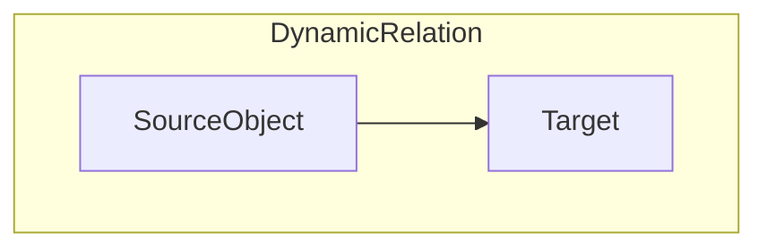
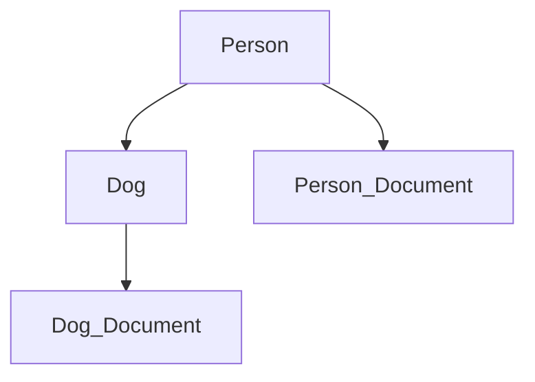
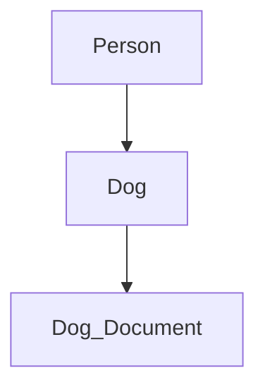

# Dynamic Relations

[](https://github.com/Mom0aut/DynamicRelations/actions/workflows/maven.yml) [](https://github.com/Mom0aut/DynamicRelations/actions/workflows/maven.yml)


Often Relations can be dynamic and difficult to predict and implement. With Dynamic Relations you can add or delete Custom Relations between Entities during runtime. The Target of the Dynamic Relation can be complete dynamic.

# What is a Dynamic Relation?

A Dynamic Relation can be viewed as a directed Graph with a fixed Input (SourceObject) and a dynmic Output (Target).



For Example with following Entities:

- Person
- Dog
- Document

A Person can have a Dog and both Entites could have Documents(Person Info Documents and Dog Info Documents). Now you could add Dynamic Relations to all Enties which could look like this: 



Each Connection is a Dynamic Relation and following Relations would be generated:

- Person Relation with SourceObject Person
- Person_Document Relation with SourceObject Person_Document
- Dog Relation with SourceObject Dog
- Dog_Document Relation with SourceObject Dog_Document

Each Relation got an Dynamic Target, that means you could create an Relation to any other Relation.

In this Scenario a Person have a Dog and both got Documents, now you could change the Relation during runtime (No altering of your Entities or Models). For example you could delete a Person_Document(got lost):



# Maven Dependency

```
<dependency>
  <groupId>io.github.Mom0aut</groupId>
  <artifactId>dynamic-relations</artifactId>
  <version>1.0.2</version>
</dependency>
```

# How to use


- [Add the @Relation to your Entity](#Relation)
- [Implement RelationIdentity](#RelationIdentity)
- [Import Config Module for Component Scan](#ImportConfig)
- [Use the RelationService](#RelationService)

## <a name="Relation"></a> Add the @Relation
Simply Add the @Relation to your existing Entity and the necessary Dynamic Relations Entity will be generated. Dynamic Relations are only working with Classed wich are **annotated with @Entity**!

```
@Relation(sourceClass = Person.class)
@Entity
@Getter
@Setter
public class Person implements RelationIdentity {

    @Id
    @GeneratedValue(strategy = GenerationType.IDENTITY)
    private Long id;

    @Override
    public String getType() {
        return "PersonType";
    }
}

```

## <a name="RelationIdentity"></a> Implement RelationIdentity
Implement the RelationIdentity, each Dynamic Relation need an Long id and an String Type which you can define.

```
@Relation(sourceClass = Person.class)
@Entity
@Getter
@Setter
public class Person implements RelationIdentity {

    @Id
    @GeneratedValue(strategy = GenerationType.IDENTITY)
    private Long id;

    @Override
    public String getType() {
        return "PersonType";
    }
}

```

## <a name="ImportConfig"></a> Import Config Module for Component Scan
Import the DrmConfig in your Spring Boot Application, so that you can use the RelationService

```
@SpringBootApplication
@Import(DrmConfig.class)
public class App {
    public static void main(String[] args) {
        SpringApplication.run(App.class, args);
    }
}
```

## <a name="RelationService"></a> Use the RelationService
```
    @Autowired
    private RelationService relationService;
   
    void createRelation() {

        Person person = new person();
        personDao.save(person);

        Dog dog = new Dog();
        dogDao.save(dog);
        
        //Dynamic Relation can only be created with persisted Entites!
        RelationLink relationLink = relationService.createRelation(person, dog);
    }

```
**Dynamic Relation can only be created with persisted Entites!**


# Contribution

Every Contribution is welcome, pls follow the [Contribution Guidlines](https://github.com/Mom0aut/DynamicRelations/blob/master/Contributing.md)
